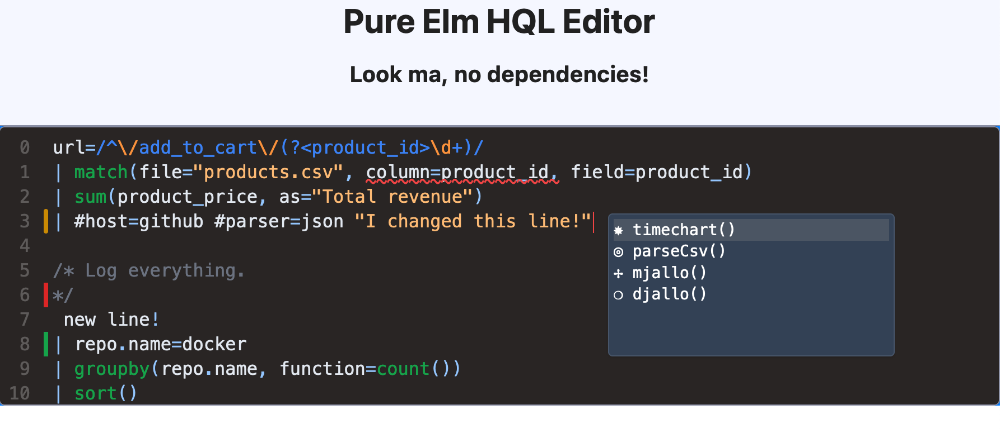

## Why?

- Lightweight, no npm package dependencies
- Elm
- Need more?

## How?
Keep overlays in sync when scrolling:

- A transparent TextArea at the top
- Syntax highlighting layer
- Autocomplete layer (press ctrl+space)
- Error overlay (squigly lines)
- Diff gutter

## Developer getting started

Requirements

- Elm 0.19
- `brew install caddy` (a simple file http server) - or BYO
- `yarn`

You'll need two terminals:

1. `caddy file-server`
2. `yarn exec elm-watch hot`

Go to http://localhost

Hack!
